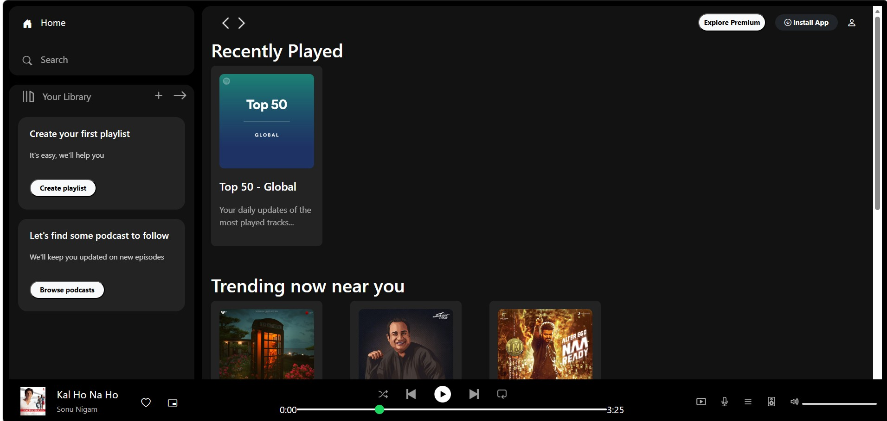

# Spotify Clone 

A simple Spotify-inspired music player UI built using HTML, CSS, and Bootstrap.

## Features
- Dark themed Spotify-like interface
- Sidebar navigation
- Music player controls
- Trending playlist section
- Responsive layout

## Technologies Used
- HTML
- CSS
- Bootstrap

## How to Run
1. Download or clone the repository
2. Open `index.html` in your browser

## Screenshots

## Future Improvements
- Add real audio functionality
- Play/Pause controls
- Search feature
- Responsive mobile design
- Dynamic playlists

## Author
Amrita
